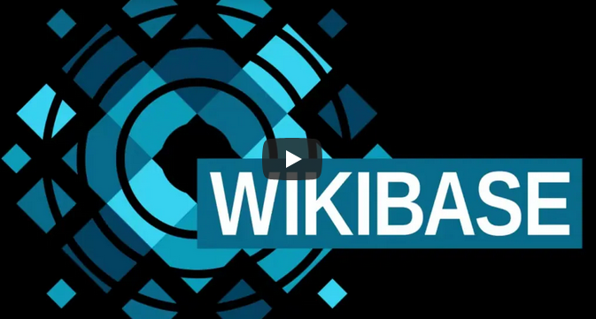

# Automated Values

[](https://github.com/ProfessionalWiki/AutomatedValues/actions?query=workflow%3ACI)
[](https://codecov.io/gh/ProfessionalWiki/AutomatedValues)
[](https://shepherd.dev/github/ProfessionalWiki/AutomatedValues)
[](psalm.xml)
[](https://packagist.org/packages/professional-wiki/wikibase-automated-values)
[](https://packagist.org/packages/professional-wiki/wikibase-automated-values)
[](LICENSE)

[Wikibase] extension that allows defining rules to automatically set labels or aliases based on Statement values.

[Professional.Wiki] created and maintains Automated Values. We provide [Wikibase hosting], [Wikibase development] and [Wikibase consulting].

Automated Values was created for the Luxembourg Ministry of Culture, who funded initial development.

You can find a demo of this extension at https://automated.wikibase.wiki

**Table of Contents**

- [Usage](#usage)
- [Installation](#installation)
- [PHP Configuration](#php-configuration)
- [Development](#development)
- [Release notes](#release-notes)

## Usage

<a href="https://www.youtube.com/watch?v=BO58wulCFVU"></a>

The core building block of this extension are so-called "Rules".

You can read the bellow step-by-step explanation or look immediately at [example.json].

A Rule consists of zero or more Entity Criteria, which allow you to specify
which Wikibase entities the Rule applies to. For instance "all entities where P1 is Q1", which might translate to "all entities instanceof Person".

```json
{
	"when": [
		{
			"statement": "P1",
			"equalTo": "Q1"
		}
	]
}
```

A rule can also have zero or more Build Specifications. These describe how to auto automatically build
values on matching Entities, and which languages to update. They are available both for Labels and Aliases.

```json
{
	"buildLabel": {
		"en": {
			"P2": "$"
		}
	},
	"buildAliases": {
		"*": {
			"P5.P3": "President ",
			"P5": "$",
			"P5.P4": ", $"
		}
	}
}
```

Rules can be defined on page `MediaWiki:AutomatedValues`.  Alternatively they can be defined in LocalSettings.php, see the [PHP Configuration](#php-configuration) section.

To define rules for your wiki, simply head over to `MediaWiki:AutomatedValues` and create the page. This page only accepts JSON that
adheres to the [JSON Schema]. If you enter invalid JSON, the page will refuse to save your changes.

Editing of pages in the `MediaWiki` namespace, which includes `MediaWiki:AutomatedValues`, is likely restricted to users
with elevated permissions. By default, MediaWiki restricts editing in this namespace to people with the `editinterface` right.
For more information, go to the page `Special:ListGroupRights#Namespace_restrictions` on your wiki.

You can find a complete and valid example of a list of Rules, that could be placed on `MediaWiki:AutomatedValues`, at [example.json].

### Supported Entity Criteria

At the moment it is only possible to check equality of statement main values, and only for Properties of type String or EntityId.

A Rule can contain multiple Entity Criteria, in which case they all need to match for the Rule to be applied. A Rule
can also contain no Entity Criteria, in which case it will be applied to all Entities.

### Build Specifications

Build Specifications are essentially templates that describe how to build the values.

You can have different Build Specifications for different languages:

```json
{
	"buildLabel": {
		"en": {
			"P2": "$"
		},
		"de": {
			"P3": "$"
		}
	}
}
```

You can also specify `*` instead of a language code, in which case the Build Specification will be applied to all default
languages. See the [PHP Configuration](#php-configuration) section for how to set the default languages. If the default
languages are not set, `*` will be ignored.

```json
{
	"buildLabel": {
		"*": {
			"P2": "$"
		},
		"de": {
			"P3": "$"
		}
	}
}
```

The `$` symbol is replaced by the Main Value of the first Statement with the specified Property. Currently only strings
are supported. Preferred Statements will be used over those with a Normal rank. If there is no matching Statement, that
part of the value is omitted. If the resulting value is an empty string, it will be ignored.

It is possible to combine multiple values and to include whitespace and other characters.

```json
{
	"de": {
		"P3": "$ ",
		"P4": "$",
		"P5": ", $"
	}
}
```

Assuming P4 is `foo`, P5 is `bar` and there not being a P3 Statement, the above would result in `foo, bar`.

You can also get the value of Qualifiers. This is done via the `P1.P2` notation, where P1 is the Property of the Statement,
and P2 is the Property of the Qualifier.

```json
{
	"de": {
		"P3": "$ ",
		"P3.P10": "$",
		"P3.P11": ", $"
	}
}
```

In case of Aliases, all matching Statements will be used, possibly resulting in multiple Aliases. The above snippet
would create two Aliases, if there are two Statements with Property P3. This is only supported for Build Specifications
that use a single Statement-level Property. The below snippet would result in only a single Alias, even if there are many
Statements.

```json
{
	"de": {
		"P3": "$",
		"P4": "$"
	}
}
```

### When Rules are applied

Rules are applied on every edit. They are not applied outside of edits. So if you are importing a dataset and wish
the Rules to be applied, you need to first define the Rules and then do the import. Alternatively you can trigger
an edit of each page with some MediaWiki script, though this functionality is not provided by the Automated Values
extension.

Rules are applied in order. In other words, the second Rule can override values set by the first Rule.

### Limitations

* When editing an Entity, the UI will not immediately show the updated generated values. A page reload is needed.
* You can only filter Entities based on Statement Main Values of type String or Entity ID.
* You can only generate Labels and Aliases.
* Rules are only applied to Entities on edit. Changing a rule will not automatically apply it everywhere.
* The editing UI is still present for automatically generated values, possibly causing confusion.

## Installation

Platform requirements:

* [PHP] 7.4 or later (tested up to 8.0)
* [MediaWiki] 1.35 or later (tested up to 1.37)
* [Wikibase] 1.35 or later (tested up to 1.37)

The recommended way to install Automated Values is using [Composer] with
[MediaWiki's built-in support for Composer][Composer install].

On the commandline, go to your wikis root directory. Then run these two commands:

```shell script
COMPOSER=composer.local.json composer require --no-update professional-wiki/wikibase-automated-values:~1.0
```
```shell script
composer update professional-wiki/wikibase-automated-values --no-dev -o
```

Then enable the extension by adding the following to the bottom of your wikis [LocalSettings.php] file:

```php
wfLoadExtension( 'AutomatedValues' );
```

You can verify the extension was enabled successfully by opening your wikis Special:Version page in your browser.

To enable more convenient editing of `MediaWiki:AutomatedValues`, you can optionally install the [CodeMirror extension].

## PHP Configuration

Configuration can be changed via [LocalSettings.php].

### Default languages

List of languages to create values for via '*' build specifications.

Variable: `$wgAutomatedValuesDefaultLanguages`

Default: `[]`

Example: `[ 'en', 'de', 'nl' ]`

If the value of this configuration is an empty list, '*' build specifications will be ignored.

### Rules

List of rules applied to the wiki. In JSON format, following the JSON Schema at [schema.json].
Gets combined with rules defined on page `MediaWiki:AutomatedValues`.

Variable: `$wgAutomatedValuesRules`

Default: `""`

Example:

```php
$wgAutomatedValuesRules = '
[
	{
		"buildLabel": {
			"en": {
				"P2": "$"
			}
		}
	}
]
';
```

**Caution**: invalid JSON will be _ignored_. No error will be shown, the intended rules will just not be applied.

### Enable in-wiki rules

If it should be possible to define rules via MediaWiki:AutomatedValues.

Variable: `$wgAutomatedValuesEnableInWikiConfig`

Default: `true`

Example: `false`

The page MediaWiki:AutomatedValues will always be available. If this configuration is set to `false`, its contents will be ignored.

## Development

To ensure the dev dependencies get installed, have this in your `composer.local.json`:

```json
{
	"require": {
		"vimeo/psalm": "^4",
		"phpstan/phpstan": "^1.4.9"
	},
	"extra": {
		"merge-plugin": {
			"include": [
				"extensions/AutomatedValues/composer.json"
			]
		}
	}
}
```

### Running tests and CI checks

You can use the `Makefile` by running make commands in the `AutomatedValues` directory.

* `make ci`: Run everything
* `make test`: Run all tests
* `make cs`: Run all style checks and static analysis

Alternatively, you can execute commands from the MediaWiki root directory:

* PHPUnit: `php tests/phpunit/phpunit.php -c extensions/AutomatedValues/`
* Style checks: `vendor/bin/phpcs -p -s --standard=extensions/AutomatedValues/phpcs.xml`
* PHPStan: `vendor/bin/phpstan analyse --configuration=extensions/AutomatedValues/phpstan.neon --memory-limit=2G`
* Psalm: `php vendor/bin/psalm --config=extensions/AutomatedValues/psalm.xml`

### High level design

The `Domain/` folder contains the domain model, which is both independent of MediaWiki code and wiki concepts beyond the
Wikibase DataModel. In other words, the `Domain/` folder is the core of the application, with no outgoing dependencies.

`Hooks.php` acts as entry point. `AutomatedValuesFactory` is the top level factory, responsible for object graph construction.

## Release notes

### Version 1.0.0 - 2022-04-29

Initial release for Wikibase 1.35 - 1.37 ([Release announcement], [Demo video]) with these features:

* Ability to build labels and aliases using segmented templates
* Ability to use both Statement Main Values and Qualifier values
* Ability to restrict application of Rules to Entities with specific String or EntityId values for a given Property
* Ability to define Rules on-wiki via the MediaWiki:AutomatedValues page

[Professional.Wiki]: https://professional.wiki
[Wikibase]: https://wikibase.consulting/what-is-wikibase/
[Wikibase hosting]: https://professional.wiki/en/hosting/wikibase
[Wikibase development]: https://professional.wiki/en/wikibase-software-development
[Wikibase consulting]: https://wikibase.consulting/
[MediaWiki]: https://www.mediawiki.org
[PHP]: https://www.php.net
[Composer]: https://getcomposer.org
[Composer install]: https://professional.wiki/en/articles/installing-mediawiki-extensions-with-composer
[LocalSettings.php]: https://www.mediawiki.org/wiki/Manual:LocalSettings.php
[JSON Schema]: https://github.com/ProfessionalWiki/AutomatedValues/blob/master/schema.json
[schema.json]: https://github.com/ProfessionalWiki/AutomatedValues/blob/master/schema.json
[example.json]: https://github.com/ProfessionalWiki/AutomatedValues/blob/master/example.json
[CodeMirror extension]: https://www.mediawiki.org/wiki/Extension:CodeMirror
[Release announcement]: https://www.wikibase.consulting/automating-values-in-wikibase/
[Demo video]: https://www.youtube.com/watch?v=BO58wulCFVU
